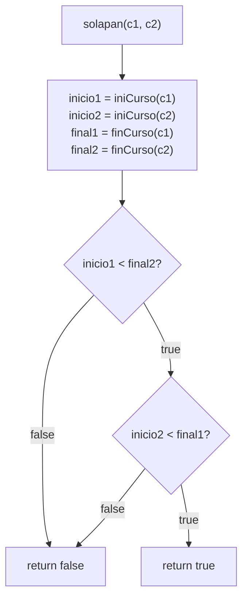
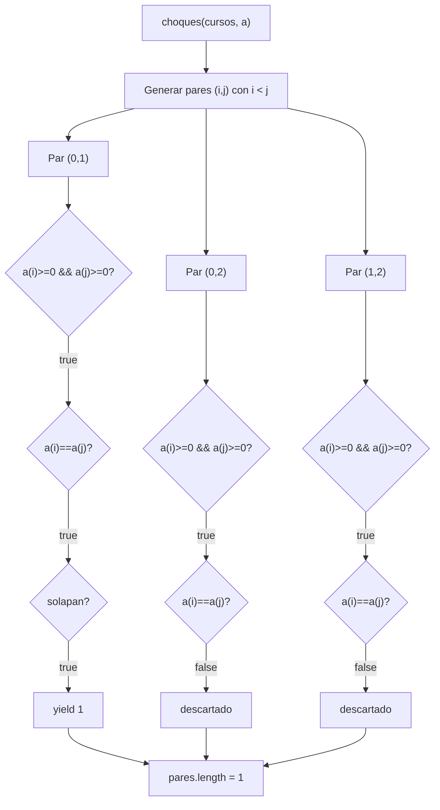
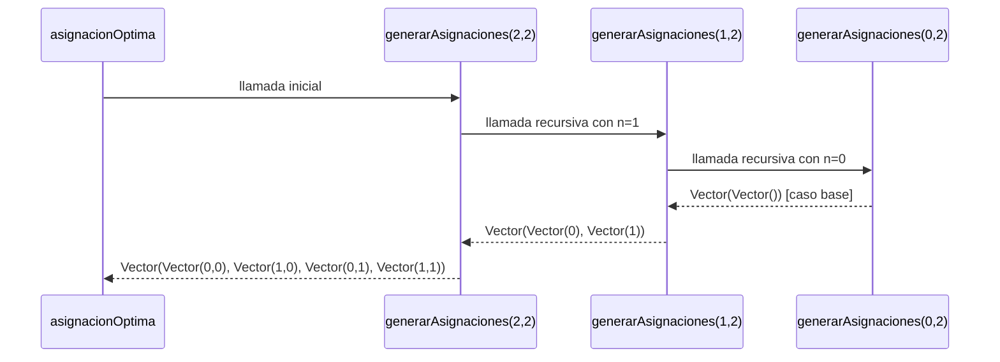
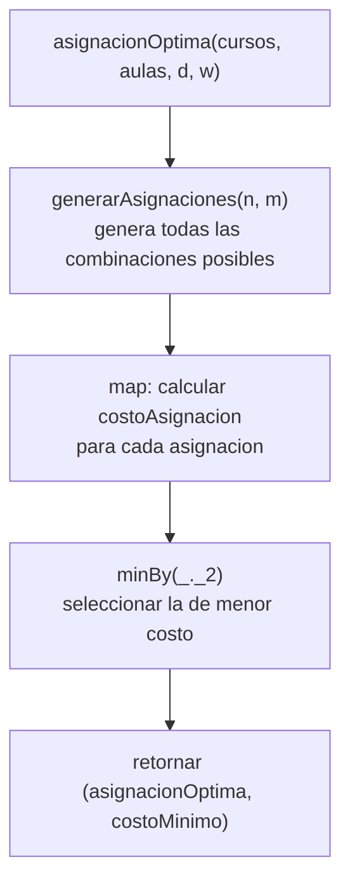

# Informe de Proceso

---
## 1. Función `solapan`

### Definición

```scala
def solapan(c1: Curso, c2: Curso): Boolean = {
  val inicio1 = iniCurso(c1)
  val inicio2 = iniCurso(c2)
  val final1  = finCurso(c1)
  val final2  = finCurso(c2)
  inicio1 < final2 && inicio2 < final1
}
```

Esta función **no es recursiva**. Evalúa una expresión booleana directamente a partir de los datos de dos cursos. El proceso consiste en extraer los valores de inicio y fin de cada curso y evaluar la condición de solapamiento.

### Condición de solapamiento

Dos intervalos `[ini1, fin1)` y `[ini2, fin2)` se solapan si y solo si:

```
ini1 < fin2  &&  ini2 < fin1
```

Esto se puede leer como: el curso 1 empieza antes de que termine el curso 2, **y** el curso 2 empieza antes de que termine el curso 1. Si alguna de las dos condiciones falla, los cursos no se solapan.

### Ejemplo: cursos que SÍ se solapan

Entrada:
- `c1 = ("M01", 4, 8, 25)` → intervalo `[4, 8)`
- `c2 = ("M02", 6, 10, 30)` → intervalo `[6, 10)`
#### Paso a paso

**Paso 1:** Extraer valores

```
inicio1 = 4
inicio2 = 6
final1  = 8
final2  = 10
```

**Paso 2:** Evaluar primera parte de la condición

```
inicio1 < final2  →  4 < 10  →  true
```

**Paso 3:** Evaluar segunda parte

```
inicio2 < final1  →  6 < 8  →  true
```

**Paso 4:** Combinar con `&&`

```
true && true  →  true
```

**Resultado:** `true` — los cursos se solapan.
 
---

### Ejemplo: cursos que NO se solapan

Entrada:
- `c1 = ("M01", 4, 8, 25)` → intervalo `[4, 8)`
- `c2 = ("M03", 12, 16, 20)` → intervalo `[12, 16)`
#### Paso a paso

**Paso 1:** Extraer valores

```
inicio1 = 4
inicio2 = 12
final1  = 8
final2  = 16
```

**Paso 2:** Evaluar primera parte

```
inicio1 < final2  →  4 < 16  →  true
```

**Paso 3:** Evaluar segunda parte

```
inicio2 < final1  →  12 < 8  →  false
```

**Paso 4:** Combinar con `&&`

```
true && false  →  false
```

**Resultado:** `false` — los cursos no se solapan.
 
---

### Diagrama del proceso de evaluación


 
---

## 2. Función `choques`

### Definición

```scala
def choques(cursos: Cursos, a: Asignacion): Int = {
  val pares = for {
    i <- 0 until cursos.length
    j <- (i + 1) until cursos.length
    if a(i) >= 0 && a(j) >= 0
    if a(i) == a(j)
    if solapan(cursos(i), cursos(j))
  } yield 1
  pares.length
}
```

Esta función **no es recursiva**. Usa una `for`-comprehension para recorrer todos los pares posibles `(i, j)` con `i < j` y cuenta cuántos de ellos comparten aula y se solapan en el tiempo.

### Ejemplo

Entrada:
- `cursos = Vector(("M01",4,8,25), ("M02",6,10,30), ("M03",12,16,20))`
- `a = Vector(0, 0, 1)` → M01 y M02 en aula 0, M03 en aula 1
  Los pares posibles con `i < j` son: `(0,1)`, `(0,2)`, `(1,2)`.

#### Evaluación de cada par

**Par (0, 1) — M01 y M02:**

```
a(0) = 0 >= 0  →  true
a(1) = 0 >= 0  →  true
a(0) == a(1)   →  0 == 0  →  true
solapan([4,8), [6,10))  →  4<10 && 6<8  →  true
→ yield 1  ✓ CHOQUE
```

**Par (0, 2) — M01 y M03:**

```
a(0) = 0 >= 0  →  true
a(2) = 1 >= 0  →  true
a(0) == a(2)   →  0 == 1  →  false
→ no pasa el filtro, no cuenta
```

**Par (1, 2) — M02 y M03:**

```
a(1) = 0 >= 0  →  true
a(2) = 1 >= 0  →  true
a(1) == a(2)   →  0 == 1  →  false
→ no pasa el filtro, no cuenta
```

**Resultado:** `pares = Vector(1)` → `pares.length = 1`
 
---

### Diagrama del proceso de evaluación


 
---

## 3. Función `asignacionOptima` y su núcleo recursivo `generarAsignaciones`

### Definición de `asignacionOptima`

```scala
def asignacionOptima(cursos: Cursos, aulas: Aulas, d: Distancias,
                     w: Pesos): (Asignacion, Int) = {
  val todasLasAsignaciones = generarAsignaciones(cursos.length, aulas.length)
  todasLasAsignaciones
    .map(asig => (asig, costoAsignacion(cursos, aulas, d, asig, w)))
    .minBy(_._2)
}
```

`asignacionOptima` en sí no es recursiva. Su parte recursiva está en `generarAsignaciones`, que genera todas las combinaciones posibles de aulas para los cursos. Luego `asignacionOptima` evalúa el costo de cada una y retorna la de menor costo.

### Definición de `generarAsignaciones`

```scala
def generarAsignaciones(n: Int, m: Int): Vector[Asignacion] = {
  if (n == 0)
    Vector(Vector())
  else {
    val anteriorAsignacion = generarAsignaciones(n - 1, m)
    anteriorAsignacion.flatMap { asignacion =>
      (0 until m).map { aulas => aulas +: asignacion }
    }
  }
}
```

- **Caso base:** cuando `n = 0` no hay cursos que asignar, se retorna un vector con una asignación vacía.
- **Caso recursivo:** se resuelve primero el problema para `n-1` cursos, y luego se extiende cada asignación anterior añadiendo al frente cada aula posible `(0 hasta m-1)`.
### Ejemplo: `generarAsignaciones(2, 2)`

Con 2 cursos y 2 aulas, el resultado esperado son `2^2 = 4` asignaciones.

#### Pila de llamados

**Llamada 1:** `generarAsignaciones(2, 2)`
- `n != 0` → llama a `generarAsignaciones(1, 2)`
  **Llamada 2:** `generarAsignaciones(1, 2)`
- `n != 0` → llama a `generarAsignaciones(0, 2)`
  **Llamada 3:** `generarAsignaciones(0, 2)`
- `n == 0` → **caso base**, retorna `Vector(Vector())`
  **Desapilando llamada 2:** recibe `Vector(Vector())`
```
Vector() → se extiende con aula 0: Vector(0)
Vector() → se extiende con aula 1: Vector(1)
retorna Vector(Vector(0), Vector(1))
```

**Desapilando llamada 1:** recibe `Vector(Vector(0), Vector(1))`
```
Vector(0) → se extiende con aula 0: Vector(0, 0)
Vector(0) → se extiende con aula 1: Vector(1, 0)
Vector(1) → se extiende con aula 0: Vector(0, 1)
Vector(1) → se extiende con aula 1: Vector(1, 1)
retorna Vector(Vector(0,0), Vector(1,0), Vector(0,1), Vector(1,1))
```

**Resultado final:** 4 asignaciones posibles.
 
---

### Diagrama de la pila de llamados


 
---

### Proceso completo de `asignacionOptima`

Una vez que `generarAsignaciones` retorna todas las asignaciones, `asignacionOptima` evalúa el costo de cada una y selecciona la mínima:


 