# Informe de Proceso

---
## 2.3. Función `solapan`

### Definición

```scala
def solapan(c1: Curso, c2: Curso): Boolean = {
  val inicio1 = iniCurso(c1)
  val inicio2 = iniCurso(c2)
  val final1  = finCurso(c1)
  val final2  = finCurso(c2)
  inicio1 < final2 && inicio2 < final1
}
```

Esta función **no es recursiva**. Evalúa una expresión booleana directamente a partir de los datos de dos cursos. El proceso consiste en extraer los valores de inicio y fin de cada curso y evaluar la condición de solapamiento.

### Condición de solapamiento

Dos intervalos `[ini1, fin1)` y `[ini2, fin2)` se solapan si y solo si:

```
ini1 < fin2  &&  ini2 < fin1
```

Esto se puede leer como: el curso 1 empieza antes de que termine el curso 2, **y** el curso 2 empieza antes de que termine el curso 1. Si alguna de las dos condiciones falla, los cursos no se solapan.

### Ejemplo: cursos que SÍ se solapan

Entrada:
- `c1 = ("M01", 4, 8, 25)` → intervalo `[4, 8)`
- `c2 = ("M02", 6, 10, 30)` → intervalo `[6, 10)`
#### Paso a paso

**Paso 1:** Extraer valores

```
inicio1 = 4
inicio2 = 6
final1  = 8
final2  = 10
```

**Paso 2:** Evaluar primera parte de la condición

```
inicio1 < final2  →  4 < 10  →  true
```

**Paso 3:** Evaluar segunda parte

```
inicio2 < final1  →  6 < 8  →  true
```

**Paso 4:** Combinar con `&&`

```
true && true  →  true
```

**Resultado:** `true` — los cursos se solapan.
 
---

### Ejemplo: cursos que NO se solapan

Entrada:
- `c1 = ("M01", 4, 8, 25)` → intervalo `[4, 8)`
- `c2 = ("M03", 12, 16, 20)` → intervalo `[12, 16)`
#### Paso a paso

**Paso 1:** Extraer valores

```
inicio1 = 4
inicio2 = 12
final1  = 8
final2  = 16
```

**Paso 2:** Evaluar primera parte

```
inicio1 < final2  →  4 < 16  →  true
```

**Paso 3:** Evaluar segunda parte

```
inicio2 < final1  →  12 < 8  →  false
```

**Paso 4:** Combinar con `&&`

```
true && false  →  false
```

**Resultado:** `false` — los cursos no se solapan.
 
---

### Diagrama del proceso de evaluación

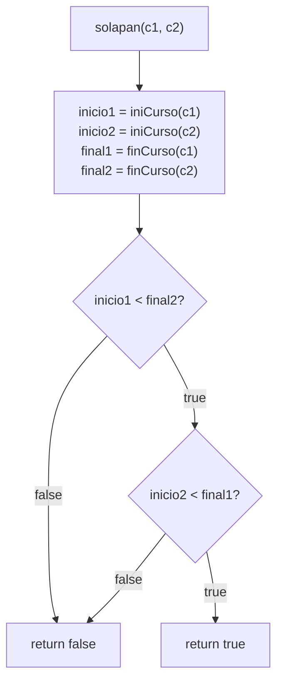
 
---

## 2.4. Función `choques`

### Definición

```scala
def choques(cursos: Cursos, a: Asignacion): Int = {
  val pares = for {
    i <- 0 until cursos.length
    j <- (i + 1) until cursos.length
    if a(i) >= 0 && a(j) >= 0
    if a(i) == a(j)
    if solapan(cursos(i), cursos(j))
  } yield 1
  pares.length
}
```

Esta función **no es recursiva**. Usa una `for`-comprehension para recorrer todos los pares posibles `(i, j)` con `i < j` y cuenta cuántos de ellos comparten aula y se solapan en el tiempo.

### Ejemplo

Entrada:
- `cursos = Vector(("M01",4,8,25), ("M02",6,10,30), ("M03",12,16,20))`
- `a = Vector(0, 0, 1)` → M01 y M02 en aula 0, M03 en aula 1
  Los pares posibles con `i < j` son: `(0,1)`, `(0,2)`, `(1,2)`.

#### Evaluación de cada par

**Par (0, 1) — M01 y M02:**

```
a(0) = 0 >= 0  →  true
a(1) = 0 >= 0  →  true
a(0) == a(1)   →  0 == 0  →  true
solapan([4,8), [6,10))  →  4<10 && 6<8  →  true
→ yield 1  ✓ CHOQUE
```

**Par (0, 2) — M01 y M03:**

```
a(0) = 0 >= 0  →  true
a(2) = 1 >= 0  →  true
a(0) == a(2)   →  0 == 1  →  false
→ no pasa el filtro, no cuenta
```

**Par (1, 2) — M02 y M03:**

```
a(1) = 0 >= 0  →  true
a(2) = 1 >= 0  →  true
a(1) == a(2)   →  0 == 1  →  false
→ no pasa el filtro, no cuenta
```

**Resultado:** `pares = Vector(1)` → `pares.length = 1`
 
---

### Diagrama del proceso de evaluación

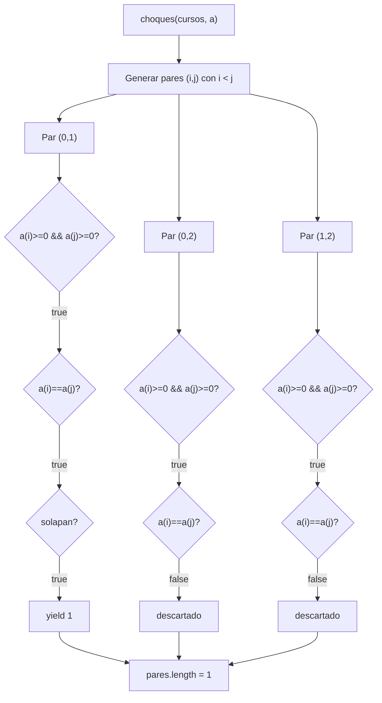

---

## 2.5. Funciones `capacidadFallida` y `desperdicio`

### Definicion de `capacidadFallida`

```scala
def capacidadFallida(cursos: Cursos, aulas: Aulas, a: Asignacion): Int = {
  val cursAuls = for {
    i <- (0 until cursos.length)
  } yield (cursos(i)._4, aulas(a(i))._2)
  cursAuls.count(p => p._2 < p._1)
}
```

Esta funcion **no es recursiva**. Usa una `for`-comprehension para
construir un vector de tuplas `(cantEstudiantes, capacidadAula)` y
luego cuenta cuantas aulas tienen capacidad insuficiente.

### Proceso de `capacidadFallida`

La funcion opera en dos etapas:

**Etapa 1 — `for`-comprehension:** para cada indice `i`, extrae la
cantidad de estudiantes del curso `cursos(i)._4` y la capacidad del
aula asignada `aulas(a(i))._2`, formando la tupla correspondiente.

**Etapa 2 — `count`:** cuenta las tuplas donde la capacidad del aula
es estrictamente menor que la cantidad de estudiantes (`p._2 < p._1`).

### Ejemplo no trivial: prueba "un curso falla"

**Datos de entrada:**

```scala
val aulas  = Vector(("E1",30), ("E2",40), ("E3",50))
val cursos = Vector(("C1",0,2,25), ("C2",2,4,35), ("C3",4,6,45), ("C4",6,8,55))
val a      = Vector(0, 1, 2, 2)
// C1 → E1(30), C2 → E2(40), C3 → E3(50), C4 → E3(50)
```

**Etapa 1 — construccion del vector de tuplas:**

| i | `cursos(i)._4` (est) | `a(i)` | `aulas(a(i))._2` (cap) | tupla |
|---|----------------------|--------|------------------------|-------|
| 0 | 25 | 0 | 30 | `(25, 30)` |
| 1 | 35 | 1 | 40 | `(35, 40)` |
| 2 | 45 | 2 | 50 | `(45, 50)` |
| 3 | 55 | 2 | 50 | `(55, 50)` |

```
cursAuls = Vector((25,30), (35,40), (45,50), (55,50))
```

**Etapa 2 — `count(p => p._2 < p._1)`:**

| tupla | `cap < est` | cuenta |
|-------|-------------|--------|
| `(25, 30)` | `30 < 25` → `false` | no |
| `(35, 40)` | `40 < 35` → `false` | no |
| `(45, 50)` | `50 < 45` → `false` | no |
| `(55, 50)` | `50 < 55` → `true`  | **si** |

**Resultado:** `1` — un curso falla. La prueba verifica `== 1`. ✓

### Diagrama del proceso de `capacidadFallida`

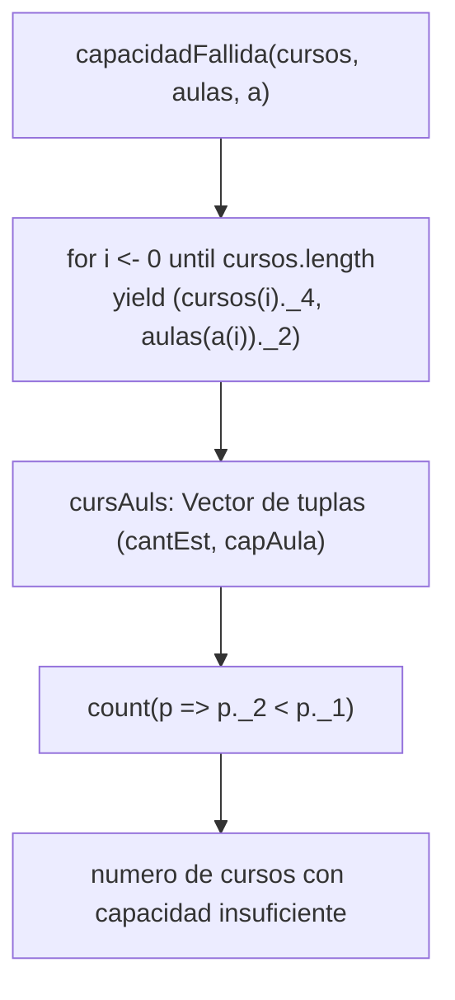

---

### Definicion de `desperdicio`

```scala
def desperdicio(cursos: Cursos, aulas: Aulas, a: Asignacion): Int = {
  val cursAuls = for {
    i <- (0 until cursos.length)
  } yield (cursos(i)._4, aulas(a(i))._2)
  val listaDesperdicio = cursAuls.toList.filter {
    case (cantEst, capacidadAuls) => capacidadAuls >= cantEst
  }.map {
    case (cantEst, capacidadAuls) => capacidadAuls - cantEst
  }
  listaDesperdicio.sum
}
```

Esta funcion **no es recursiva**. Usa una `for`-comprehension seguida
de una cadena `filter` → `map` → `sum` para calcular el total de
puestos sobrantes en las aulas con capacidad suficiente.

### Proceso de `desperdicio`

La funcion opera en tres etapas:

**Etapa 1 — `for`-comprehension:** identica a `capacidadFallida`,
construye el vector de tuplas `(cantEstudiantes, capacidadAula)`.

**Etapa 2 — `filter`:** retiene solo las tuplas donde el aula
tiene capacidad suficiente (`capacidadAuls >= cantEst`). Las aulas
con capacidad insuficiente no aportan desperdicio.

**Etapa 3 — `map` + `sum`:** calcula la diferencia `capacidadAuls - cantEst`
para cada tupla filtrada y suma todos los valores.

### Ejemplo no trivial: prueba "cursos sin capacidad suficiente no aportan desperdicio"

**Datos de entrada:**

```scala
val cursos = Vector(("A",0,2,35), ("B",2,4,20))
val aulas  = Vector(("E1",30), ("E2",40))
val a      = Vector(0, 1)
// A → E1(30), B → E2(40)
```

**Etapa 1 — construccion del vector de tuplas:**

| i | est | cap | tupla |
|---|-----|-----|-------|
| 0 | 35 | 30 | `(35, 30)` |
| 1 | 20 | 40 | `(20, 40)` |

```
cursAuls = Vector((35,30), (20,40))
```

**Etapa 2 — `filter(capacidadAuls >= cantEst)`:**

| tupla | `cap >= est` | pasa |
|-------|-------------|------|
| `(35, 30)` | `30 >= 35` → `false` | **descartada** |
| `(20, 40)` | `40 >= 20` → `true`  | conservada |

```
filtrado = List((20, 40))
```

**Etapa 3 — `map` + `sum`:**

```
(20, 40) → 40 - 20 = 20
listaDesperdicio = List(20)
listaDesperdicio.sum = 20
```

**Resultado:** `20`. La prueba verifica `== 20`. ✓

> El curso A con 35 estudiantes asignado al aula E1 de capacidad 30
> no aporta desperdicio porque la capacidad es insuficiente. Solo
> el curso B contribuye con 20 puestos sobrantes.

### Ejemplo adicional: prueba "capacidad exacta produce desperdicio 0"

```scala
val cursos = Vector(("A",0,2,30), ("B",2,4,40), ("C",4,6,50))
val aulas  = Vector(("E1",30), ("E2",40), ("E3",50))
val a      = Vector(0, 1, 2)
```

**Etapa 1:**

```
cursAuls = Vector((30,30), (40,40), (50,50))
```

**Etapa 2 — filter:** todas pasan (`30>=30`, `40>=40`, `50>=50`).

**Etapa 3 — map + sum:**

```
(30,30) → 30-30 = 0
(40,40) → 40-40 = 0
(50,50) → 50-50 = 0
sum = 0
```

**Resultado:** `0`. La prueba verifica `== 0`. ✓

### Diagrama del proceso de `desperdicio`

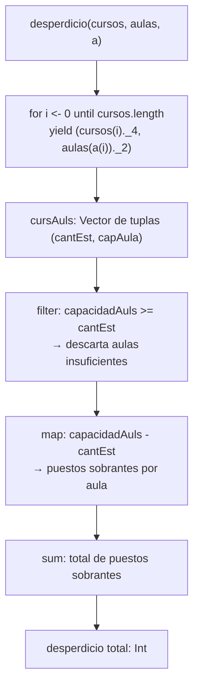

---

## 2.8. Funcion `generarAsignaciones` (version secuencial)

### Definicion

```scala
def generarAsignaciones(n: Int, m: Int): Vector[Asignacion] = {
  if (n == 0)
    Vector(Vector())
  else {
    val anteriorAsignacion = generarAsignaciones(n - 1, m)
    anteriorAsignacion.flatMap { asignacion =>
      (0 until m).map { aula => aula +: asignacion }
    }
  }
}
```

Esta funcion **es recursiva**. Genera todas las asignaciones posibles
de $m$ aulas para $n$ cursos, produciendo $m^n$ asignaciones en total.

- **Caso base:** `n == 0` — no hay cursos, retorna un vector con
  una unica asignacion vacia como punto de arranque.
- **Caso recursivo:** resuelve el problema para `n-1` cursos y luego
  extiende cada asignacion anterior agregando al frente cada una de
  las `m` aulas posibles.

### Ejemplo no trivial: `generarAsignaciones(3, 2)`

Con 3 cursos y 2 aulas se esperan $2^3 = 8$ asignaciones.

#### Pila de llamados

**Llamada 1:** `generarAsignaciones(3, 2)`
- `n != 0` → llama a `generarAsignaciones(2, 2)`

**Llamada 2:** `generarAsignaciones(2, 2)`
- `n != 0` → llama a `generarAsignaciones(1, 2)`

**Llamada 3:** `generarAsignaciones(1, 2)`
- `n != 0` → llama a `generarAsignaciones(0, 2)`

**Llamada 4:** `generarAsignaciones(0, 2)`
- `n == 0` → **caso base**, retorna `Vector(Vector())`

**Desapilando llamada 3:** recibe `Vector(Vector())`

```
Vector() + aula 0 → Vector(0)
Vector() + aula 1 → Vector(1)
retorna Vector(Vector(0), Vector(1))
```

**Desapilando llamada 2:** recibe `Vector(Vector(0), Vector(1))`

```
Vector(0) + aula 0 → Vector(0, 0)
Vector(0) + aula 1 → Vector(1, 0)
Vector(1) + aula 0 → Vector(0, 1)
Vector(1) + aula 1 → Vector(1, 1)
retorna Vector(Vector(0,0), Vector(1,0), Vector(0,1), Vector(1,1))
```

**Desapilando llamada 1:** recibe las 4 asignaciones anteriores

```
Vector(0,0) + aula 0 → Vector(0, 0, 0)
Vector(0,0) + aula 1 → Vector(1, 0, 0)
Vector(1,0) + aula 0 → Vector(0, 1, 0)
Vector(1,0) + aula 1 → Vector(1, 1, 0)
Vector(0,1) + aula 0 → Vector(0, 0, 1)
Vector(0,1) + aula 1 → Vector(1, 0, 1)
Vector(1,1) + aula 0 → Vector(0, 1, 1)
Vector(1,1) + aula 1 → Vector(1, 1, 1)
retorna Vector de 8 asignaciones
```

**Resultado final:** 8 asignaciones. La prueba `generarAsignaciones(3,2).length == 8` verifica este caso. ✓

### Diagrama de la pila de llamados

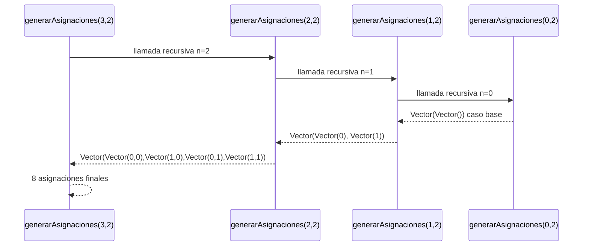


---

## 2.9. Función `asignacionOptima` y su núcleo recursivo `generarAsignaciones`

### Definición de `asignacionOptima`

```scala
def asignacionOptima(cursos: Cursos, aulas: Aulas, d: Distancias,
                     w: Pesos): (Asignacion, Int) = {
  val todasLasAsignaciones = generarAsignaciones(cursos.length, aulas.length)
  todasLasAsignaciones
    .map(asig => (asig, costoAsignacion(cursos, aulas, d, asig, w)))
    .minBy(_._2)
}
```

`asignacionOptima` en sí no es recursiva. Su parte recursiva está en `generarAsignaciones`, que genera todas las combinaciones posibles de aulas para los cursos. Luego `asignacionOptima` evalúa el costo de cada una y retorna la de menor costo.

### Definición de `generarAsignaciones`

```scala
def generarAsignaciones(n: Int, m: Int): Vector[Asignacion] = {
  if (n == 0)
    Vector(Vector())
  else {
    val anteriorAsignacion = generarAsignaciones(n - 1, m)
    anteriorAsignacion.flatMap { asignacion =>
      (0 until m).map { aulas => aulas +: asignacion }
    }
  }
}
```

- **Caso base:** cuando `n = 0` no hay cursos que asignar, se retorna un vector con una asignación vacía.
- **Caso recursivo:** se resuelve primero el problema para `n-1` cursos, y luego se extiende cada asignación anterior añadiendo al frente cada aula posible `(0 hasta m-1)`.
### Ejemplo: `generarAsignaciones(2, 2)`

Con 2 cursos y 2 aulas, el resultado esperado son `2^2 = 4` asignaciones.

#### Pila de llamados

**Llamada 1:** `generarAsignaciones(2, 2)`
- `n != 0` → llama a `generarAsignaciones(1, 2)`
  **Llamada 2:** `generarAsignaciones(1, 2)`
- `n != 0` → llama a `generarAsignaciones(0, 2)`
  **Llamada 3:** `generarAsignaciones(0, 2)`
- `n == 0` → **caso base**, retorna `Vector(Vector())`
  **Desapilando llamada 2:** recibe `Vector(Vector())`
```
Vector() → se extiende con aula 0: Vector(0)
Vector() → se extiende con aula 1: Vector(1)
retorna Vector(Vector(0), Vector(1))
```

**Desapilando llamada 1:** recibe `Vector(Vector(0), Vector(1))`
```
Vector(0) → se extiende con aula 0: Vector(0, 0)
Vector(0) → se extiende con aula 1: Vector(1, 0)
Vector(1) → se extiende con aula 0: Vector(0, 1)
Vector(1) → se extiende con aula 1: Vector(1, 1)
retorna Vector(Vector(0,0), Vector(1,0), Vector(0,1), Vector(1,1))
```

**Resultado final:** 4 asignaciones posibles.
 
---

### Diagrama de la pila de llamados

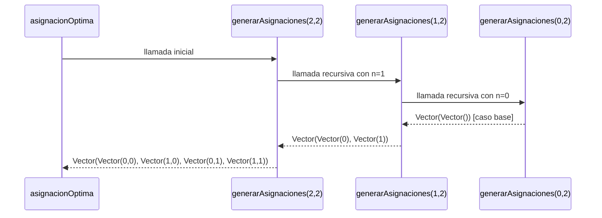
 
---

### Proceso completo de `asignacionOptima`

Una vez que `generarAsignaciones` retorna todas las asignaciones, `asignacionOptima` evalúa el costo de cada una y selecciona la mínima:

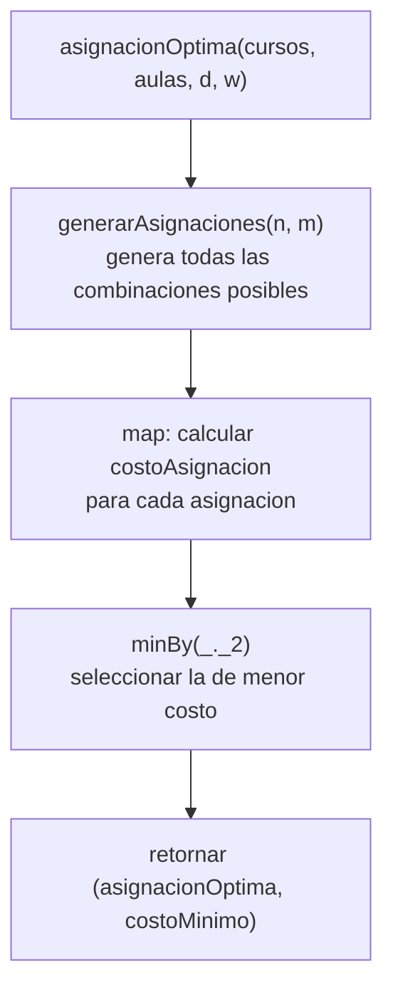
---

## 3.1. Funcion `choquesPar`

### Definicion

```scala
def choquesPar(cursos: Cursos, a: Asignacion): Int = {
  val n   = cursos.length
  val mid = n / 2

  def choquesRango(desde: Int, hasta: Int): Int =
    (desde until hasta).toVector.flatMap { i =>
      (i + 1 until n).toVector
        .filter(j => a(i) >= 0 && a(j) >= 0 && a(i) == a(j))
        .map(j => if (solapan(cursos(i), cursos(j))) 1 else 0)
    }.sum

  val (t1, t2) = parallel(choquesRango(0, mid), choquesRango(mid, n))
  t1 + t2
}
```

Esta funcion **no es recursiva directamente**. Divide el rango de
indices en dos mitades y ejecuta `choquesRango` en paralelo sobre
cada mitad, combinando los resultados con `+`.

### Estructura del calculo

La funcion auxiliar `choquesRango(desde, hasta)` recorre todos los
indices $i \in [\text{desde}, \text{hasta})$ y para cada uno evalua
todos los $j \in (i, n)$, aplicando tres condiciones:

| Condicion | Descripcion |
|---|---|
| `a(i) >= 0 && a(j) >= 0` | Ambos cursos tienen aula asignada |
| `a(i) == a(j)` | Comparten la misma aula |
| `solapan(cursos(i), cursos(j))` | Sus intervalos se solapan |

Si las tres condiciones se cumplen, el par contribuye con `1` al
conteo. Al final se suman todos los valores con `.sum`.

La division paralela es:

$$
\text{choquesPar} = \text{choquesRango}(0, \lfloor n/2 \rfloor) + \text{choquesRango}(\lfloor n/2 \rfloor, n)
$$

### Ejemplo no trivial: prueba "cuatro cursos en la misma aula generan 6 choques"

**Datos de entrada:**

```scala
val cursos = Vector(
  ("C1",0,10,20), ("C2",1,11,20),
  ("C3",2,12,20), ("C4",3,13,20)
)
val asig = Vector(0, 0, 0, 0)
// n=4, mid=2
```

Todos los cursos comparten aula 0 y todos se solapan entre si
(todos inician dentro del intervalo del anterior). Los pares
posibles con $i < j$ son: $(0,1),(0,2),(0,3),(1,2),(1,3),(2,3)$ — 6 pares.

**Mitad izquierda: `choquesRango(0, 2)` — indices i=0, i=1**

Para $i=0$: evalua $j \in \{1,2,3\}$

| j | `a(i)>=0 && a(j)>=0` | `a(i)==a(j)` | `solapan` | contribuye |
|---|---|---|---|---|
| 1 | true | `0==0` true | `0<11 && 1<10` true | **1** |
| 2 | true | `0==0` true | `0<12 && 2<10` true | **1** |
| 3 | true | `0==0` true | `0<13 && 3<10` true | **1** |

Para $i=1$: evalua $j \in \{2,3\}$

| j | `a(i)>=0 && a(j)>=0` | `a(i)==a(j)` | `solapan` | contribuye |
|---|---|---|---|---|
| 2 | true | `0==0` true | `1<12 && 2<11` true | **1** |
| 3 | true | `0==0` true | `1<13 && 3<11` true | **1** |

$$
t_1 = 3 + 2 = 5
$$

**Mitad derecha: `choquesRango(2, 4)` — indices i=2, i=3**

Para $i=2$: evalua $j \in \{3\}$

| j | `a(i)>=0 && a(j)>=0` | `a(i)==a(j)` | `solapan` | contribuye |
|---|---|---|---|---|
| 3 | true | `0==0` true | `2<13 && 3<12` true | **1** |

Para $i=3$: evalua $j \in \{\}$ — rango vacio, suma 0.

$$
t_2 = 1
$$

**Combinacion:**

$$
\text{choquesPar} = t_1 + t_2 = 5 + 1 = 6
$$

La prueba verifica `choquesPar(cursos, asig) == 6`. ✓

### Ejemplo adicional: prueba "mezcla de cursos asignados y sin asignar"

```scala
val cursos = Vector(("C1",0,6,20), ("C2",2,8,20), ("C3",4,10,20))
val asig   = Vector(0, -1, 0)
// n=3, mid=1
```

**`choquesRango(0, 1)`** — solo $i=0$: evalua $j \in \{1,2\}$

| j | `a(0)>=0 && a(j)>=0` | resultado |
|---|---|---|
| 1 | `0>=0 && -1>=0` → false | descartado |
| 2 | `0>=0 && 0>=0` → true, `0==0` true, `solapan([0,6),[4,10))` → `0<10 && 4<6` true | **1** |

$t_1 = 1$

**`choquesRango(1, 3)`** — $i=1$ e $i=2$

Para $i=1$: $j \in \{2\}$: `a(1)=-1 >= 0` → false → descartado.
Para $i=2$: $j \in \{\}$ — rango vacio.

$t_2 = 0$

**Resultado:** $1 + 0 = 1$. La prueba verifica `== 1`. ✓

### Diagrama del proceso

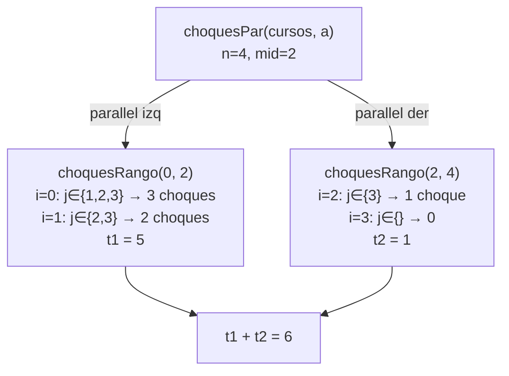

---

## 3.1. Funcion `desperdicioPar`

### Definicion

```scala
def desperdicioPar(cursos: Cursos, aulas: Aulas, a: Asignacion): Int = {
  val n   = cursos.length
  val mid = n / 2

  def desperdicioRango(desde: Int, hasta: Int): Int =
    (desde until hasta).toVector
      .filter(i => a(i) >= 0 && capAula(aulas(a(i))) >= estCurso(cursos(i)))
      .map(i => capAula(aulas(a(i))) - estCurso(cursos(i)))
      .sum

  val (t1, t2) = parallel(desperdicioRango(0, mid), desperdicioRango(mid, n))
  t1 + t2
}
```

Esta funcion **no es recursiva**. Divide el vector de cursos en dos
mitades y calcula el desperdicio de cada mitad en paralelo.

### Estructura del calculo

La funcion auxiliar `desperdicioRango(desde, hasta)` opera en tres etapas:

| Etapa | Operacion | Descripcion |
|---|---|---|
| 1 | `filter` | Retiene indices donde `a(i) >= 0` y `capAula >= estCurso` |
| 2 | `map` | Calcula `capAula - estCurso` para cada indice retenido |
| 3 | `sum` | Suma todos los desperdicios parciales |

La division paralela es:

$$
\text{desperdicioPar} = \text{desperdicioRango}(0, \lfloor n/2 \rfloor) + \text{desperdicioRango}(\lfloor n/2 \rfloor, n)
$$

### Ejemplo no trivial: prueba "desperdicio repartido entre ambas mitades"

**Datos de entrada:**

```scala
val cursos = Vector(
  ("A",0,2,10), ("B",2,4,20),
  ("C",4,6,15), ("D",6,8,25)
)
val aulas = Vector(("E1",30))
val a     = Vector(0, 0, 0, 0)
// n=4, mid=2, capAula(E1)=30
```

**Mitad izquierda: `desperdicioRango(0, 2)` — indices 0 y 1**

| i | `a(i)>=0` | `cap>=est` | `cap-est` |
|---|---|---|---|
| 0 | true | `30>=10` true | `30-10=20` |
| 1 | true | `30>=20` true | `30-20=10` |

$t_1 = 20 + 10 = 30$

**Mitad derecha: `desperdicioRango(2, 4)` — indices 2 y 3**

| i | `a(i)>=0` | `cap>=est` | `cap-est` |
|---|---|---|---|
| 2 | true | `30>=15` true | `30-15=15` |
| 3 | true | `30>=25` true | `30-25=5` |

$t_2 = 15 + 5 = 20$

**Combinacion:**

$$
\text{desperdicioPar} = t_1 + t_2 = 30 + 20 = 50
$$

La prueba verifica `== 50`. ✓

### Ejemplo adicional: prueba "todos los cursos exceden la capacidad"

```scala
val cursos = Vector(("A",0,2,60), ("B",2,4,70), ("C",4,6,80))
val aulas  = Vector(("E1",30), ("E2",40))
val a      = Vector(0, 1, 0)
// n=3, mid=1
```

**`desperdicioRango(0, 1)`:** $i=0$: `30>=60` false → descartado. $t_1=0$

**`desperdicioRango(1, 3)`:** $i=1$: `40>=70` false → descartado. $i=2$: `30>=80` false → descartado. $t_2=0$

**Resultado:** $0 + 0 = 0$. La prueba verifica `== 0`. ✓

### Diagrama del proceso

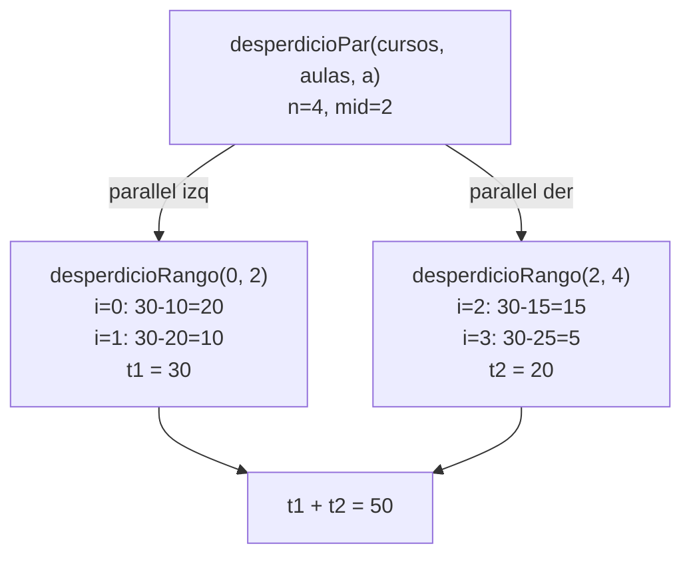

---

## 3.1. Funcion `movilidadPar`

### Definicion

```scala
def movilidadPar(cursos: Cursos, aulas: Aulas, d: Distancias,
                 a: Asignacion): Int = {
  val ordenados = cursos.indices.toVector
    .filter(i => a(i) >= 0)
    .sortBy(i => iniCurso(cursos(i)))

  if (ordenados.length < 2) 0
  else {
    val pares = ordenados.zip(ordenados.tail)
    val ini   = 0
    val fin   = pares.length
    val mid   = ini + (fin - ini) / 2

    val (t1, t2) = parallel(
      pares.slice(ini, mid).map { case (i, j) => d(a(i))(a(j)) }.sum,
      pares.slice(mid, fin).map { case (i, j) => d(a(i))(a(j)) }.sum
    )
    t1 + t2
  }
}
```

Esta funcion **no es recursiva**. Calcula la movilidad total como
la suma de distancias entre aulas de cursos consecutivos (ordenados
por inicio), ejecutando la suma en paralelo sobre dos mitades del
vector de pares.

### Estructura del calculo

La funcion opera en cuatro etapas antes de la division paralela:

| Etapa | Operacion | Descripcion |
|---|---|---|
| 1 | `filter` | Descarta indices con `a(i) < 0` (sin asignar) |
| 2 | `sortBy` | Ordena los indices restantes por `iniCurso` |
| 3 | `zip(tail)` | Forma pares consecutivos `(i, j)` |
| 4 | `parallel` | Divide los pares en dos mitades y suma distancias |

### Ejemplo no trivial: prueba "cuatro cursos alternando aulas generan movilidad 9"

**Datos de entrada:**

```scala
val cursos = Vector(
  ("C1",0,2,20), ("C2",2,4,20),
  ("C3",4,6,20), ("C4",6,8,20)
)
val aulas = Vector(("E1",30), ("E2",30))
val d     = Vector(Vector(0,3), Vector(3,0))
val a     = Vector(0, 1, 0, 1)
// d(0)(1)=3, d(1)(0)=3
```

**Etapa 1 — filter:** todos tienen `a(i) >= 0` → `ordenados = Vector(0,1,2,3)`

**Etapa 2 — sortBy iniCurso:** ya ordenados por inicio (0,2,4,6) → sin cambio.

**Etapa 3 — zip(tail):**

```
pares = Vector((0,1), (1,2), (2,3))
// fin=3, mid=1
```

**Etapa 4 — parallel:**

**Mitad izquierda:** `pares.slice(0,1)` = `Vector((0,1))`

```
(0,1) → d(a(0))(a(1)) = d(0)(1) = 3
t1 = 3
```

**Mitad derecha:** `pares.slice(1,3)` = `Vector((1,2),(2,3))`

```
(1,2) → d(a(1))(a(2)) = d(1)(0) = 3
(2,3) → d(a(2))(a(3)) = d(0)(1) = 3
t2 = 3 + 3 = 6
```

**Combinacion:**

$$
\text{movilidadPar} = t_1 + t_2 = 3 + 6 = 9
$$

La prueba verifica `== 9`. ✓

### Ejemplo adicional: prueba "cursos sin asignar no participan"

```scala
val cursos = Vector(("C1",0,2,20), ("C2",2,4,20), ("C3",4,6,20))
val d      = Vector(Vector(0,5), Vector(5,0))
val a      = Vector(0, -1, 1)
```

**Etapa 1 — filter:** descarta $i=1$ porque `a(1)=-1 < 0`.

```
ordenados = Vector(0, 2)
```

**Etapa 2 — sortBy:** `iniCurso(cursos(0))=0`, `iniCurso(cursos(2))=4` → sin cambio.

**Etapa 3 — zip(tail):**

```
pares = Vector((0, 2))   // un solo par
fin=1, mid=0
```

**Etapa 4 — parallel:**

Mitad izquierda: `pares.slice(0,0)` = vacio → $t_1 = 0$

Mitad derecha: `pares.slice(0,1)` = `Vector((0,2))`

```
(0,2) → d(a(0))(a(2)) = d(0)(1) = 5
t2 = 5
```

**Resultado:** $0 + 5 = 5$. La prueba verifica `== 5`. ✓

### Caso limite: prueba "todos en la misma aula generan movilidad 0"

Cuando todos los cursos estan en el mismo aula, `d(k)(k) = 0` para
todo $k$. Todos los pares producen distancia $0$ y la suma total es $0$.
La prueba verifica `== 0`. ✓

### Caso limite: `ordenados.length < 2`

Si hay cero o un curso asignado, no existen pares consecutivos y
la movilidad es $0$ por definicion. La funcion retorna `0` directamente
sin llamar a `parallel`.

### Diagrama del proceso

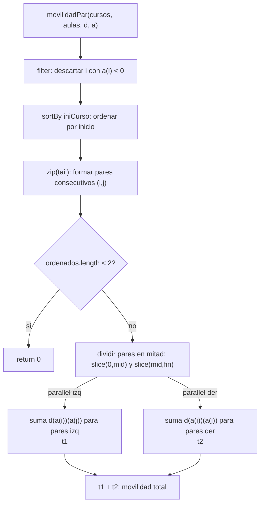


---

## 3.2. Funcion `generarAsignacionesPar` (version paralela)

### Definicion

```scala
def generarAsignacionesPar(n: Int, m: Int): Vector[Asignacion] = {
  if (n == 0)
    Vector(Vector())
  else {
    val anteriorAsignacion = generarAsignacionesPar(n - 1, m)
    def aux(vect: Vector[Int]): Vector[Asignacion] = {
      if (vect.length == 1)
        anteriorAsignacion.map(asigAnterior => vect(0) +: asigAnterior)
      else {
        val (vect1, vect2) = vect.splitAt(vect.length / 2)
        val (a, b) = parallel(aux(vect1), aux(vect2))
        a ++ b
      }
    }
    aux((0 until m).toVector)
  }
}
```

Esta funcion **es recursiva** en dos niveles:

- **Recursion externa** sobre `n`: identica a `generarAsignaciones`,
  reduce el problema al de `n-1` cursos.
- **Recursion interna** de `aux` sobre el vector de aulas `(0 until m)`:
  divide el vector de aulas por la mitad y procesa cada mitad en
  paralelo con `parallel`, combinando los resultados con `++`.

### Diferencia clave respecto a la version secuencial

| Aspecto | `generarAsignaciones` | `generarAsignacionesPar` |
|---|---|---|
| Iteracion sobre aulas | `flatMap` secuencial | `aux` recursiva con `parallel` |
| Division del trabajo | ninguna | `splitAt(length/2)` |
| Combinacion | implicita en `flatMap` | `a ++ b` explicita |
| Caso base de `aux` | N/A | `vect.length == 1` |

### Ejemplo no trivial: `generarAsignacionesPar(2, 4)`

Con 2 cursos y 4 aulas se esperan $4^2 = 16$ asignaciones.

**Paso 1 — recursion externa:**

```
generarAsignacionesPar(2, 4)
  → anteriorAsignacion = generarAsignacionesPar(1, 4)
      → anteriorAsignacion = generarAsignacionesPar(0, 4)
          → caso base: Vector(Vector())
      → aux(Vector(0,1,2,3)) sobre Vector(Vector())
          → splitAt(2): vect1=Vector(0,1), vect2=Vector(2,3)
          → parallel:
              aux(Vector(0,1)): Vector(Vector(0), Vector(1))
              aux(Vector(2,3)): Vector(Vector(2), Vector(3))
          → a ++ b = Vector(Vector(0),Vector(1),Vector(2),Vector(3))
      retorna Vector(Vector(0),Vector(1),Vector(2),Vector(3))
```

**Paso 2 — `aux` sobre 4 aulas con `anteriorAsignacion` de n=1:**

```
aux(Vector(0,1,2,3))
  splitAt(2): vect1=Vector(0,1), vect2=Vector(2,3)
  parallel:
    aux(Vector(0,1)):
      splitAt(1): vect1=Vector(0), vect2=Vector(1)
      parallel:
        aux(Vector(0)): caso base → Vector(0) +: cada asig anterior
          → Vector(Vector(0,0),Vector(0,1),Vector(0,2),Vector(0,3))
        aux(Vector(1)): caso base → Vector(1) +: cada asig anterior
          → Vector(Vector(1,0),Vector(1,1),Vector(1,2),Vector(1,3))
      a ++ b = 8 asignaciones con aula 0 o 1 al frente

    aux(Vector(2,3)):
      splitAt(1): vect1=Vector(2), vect2=Vector(3)
      parallel:
        aux(Vector(2)): → Vector(Vector(2,0),...,Vector(2,3))
        aux(Vector(3)): → Vector(Vector(3,0),...,Vector(3,3))
      a ++ b = 8 asignaciones con aula 2 o 3 al frente

  resultado final: 16 asignaciones
```

La prueba `generarAsignaciones(4,2).length == 16` verifica un caso
equivalente con 4 cursos y 2 aulas. ✓

### Arbol de llamadas paralelas de `aux`

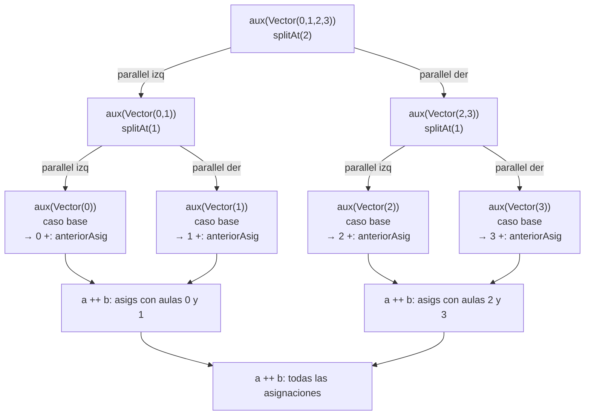

### Diagrama de la pila de llamados completa

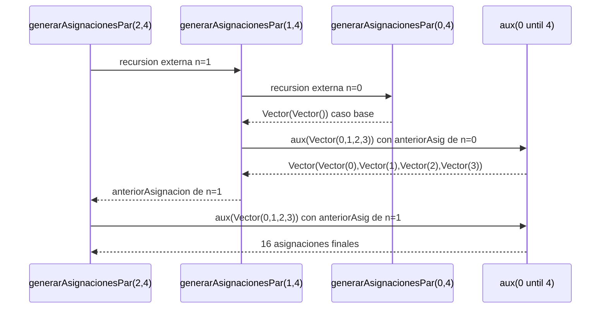

### Correctitud de la paralelizacion

La paralelizacion en `aux` es correcta porque la generacion de
asignaciones para distintas aulas es completamente independiente:
el resultado de `aux(vect1)` no depende del resultado de `aux(vect2)`.
Ambas ramas leen `anteriorAsignacion` pero no la modifican, por lo
que no hay condiciones de carrera. La combinacion `a ++ b` es
determinista y produce el mismo resultado que la version secuencial
con `flatMap`, como verifican las pruebas:

```scala
assert(generarAsignaciones(2,3).length == 9)
assert(resultado.distinct.length == resultado.length)
assert(resultado.forall(asig => asig.forall(aula => aula >= 0 && aula < m)))
```
## 3.3. Funcion `asignacionOptimaPar` (version paralela)

---
## Definición

```scala
def asignacionOptimaPar(cursos: Cursos, aulas: Aulas, d: Distancias,
                        w: Pesos): (Asignacion, Int) = {
  val todasLasAsignaciones = generarAsignaciones(cursos.length, aulas.length)
  val mitad = todasLasAsignaciones.length / 2
  val mitadIzq = todasLasAsignaciones.take(mitad)
  val mitadDer = todasLasAsignaciones.drop(mitad)
  val (minimoIzq, minimoDer) = parallel(
    mitadIzq.map(asig => (asig, costoAsignacion(cursos, aulas, d, asig, w))).minBy(_._2),
    mitadDer.map(asig => (asig, costoAsignacion(cursos, aulas, d, asig, w))).minBy(_._2)
  )
  if (minimoIzq._2 <= minimoDer._2) minimoIzq else minimoDer
}
```

Esta función **no es recursiva**. Su proceso consiste en dividir el espacio de búsqueda en dos mitades y evaluar cada mitad en paralelo usando `parallel`.

### Ejemplo

Entrada:
- `cursos = Vector(("M01",4,8,25), ("M02",6,10,30), ("M03",12,16,20))`
- `aulas = Vector(("E101",30), ("E102",40))`
- `d = Vector(Vector(0,3), Vector(3,0))`
- `w = (1000, 100, 1, 2)`
  Con 3 cursos y 2 aulas, `generarAsignaciones(3, 2)` produce $2^3 = 8$ asignaciones posibles.

#### Paso 1: Generar todas las asignaciones

```
todasLasAsignaciones = Vector(
  Vector(0,0,0), Vector(1,0,0), Vector(0,1,0), Vector(1,1,0),
  Vector(0,0,1), Vector(1,0,1), Vector(0,1,1), Vector(1,1,1)
)
```

#### Paso 2: Dividir en dos mitades

```
mitad    = 8 / 2 = 4
mitadIzq = Vector(Vector(0,0,0), Vector(1,0,0), Vector(0,1,0), Vector(1,1,0))
mitadDer = Vector(Vector(0,0,1), Vector(1,0,1), Vector(0,1,1), Vector(1,1,1))
```

#### Paso 3: Evaluar cada mitad en paralelo

```
Hilo izquierdo evalúa:
  (Vector(0,0,0), costo) , (Vector(1,0,0), costo), ...
  → minimoIzq = (Vector(0,1,0), 37)
 
Hilo derecho evalúa:
  (Vector(0,0,1), costo), (Vector(1,0,1), costo), ...
  → minimoDer = (Vector(0,1,1), costo)
```

#### Paso 4: Comparar y retornar el mínimo global

```
minimoIzq._2 = 37
minimoDer._2 = algún costo >= 37
→ retorna (Vector(0,1,0), 37)
```

### Diagrama del proceso

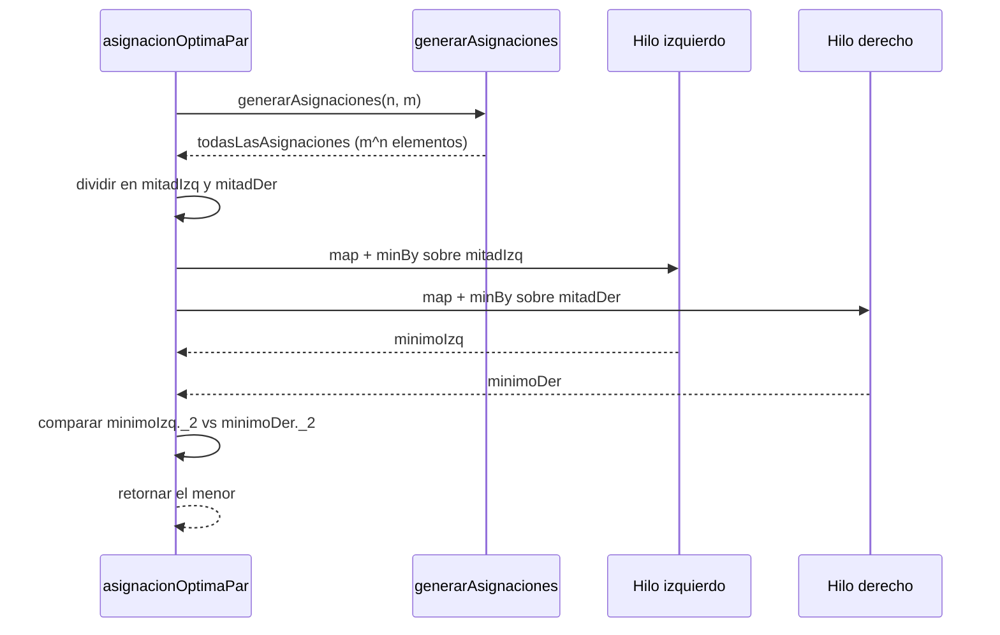
 
---
 