# Informe de Proceso

---
## 2.3. Función `solapan`

### Definición

```scala
def solapan(c1: Curso, c2: Curso): Boolean = {
  val inicio1 = iniCurso(c1)
  val inicio2 = iniCurso(c2)
  val final1  = finCurso(c1)
  val final2  = finCurso(c2)
  inicio1 < final2 && inicio2 < final1
}
```

Esta función **no es recursiva**. Evalúa una expresión booleana directamente a partir de los datos de dos cursos. El proceso consiste en extraer los valores de inicio y fin de cada curso y evaluar la condición de solapamiento.

### Condición de solapamiento

Dos intervalos `[ini1, fin1)` y `[ini2, fin2)` se solapan si y solo si:

```
ini1 < fin2  &&  ini2 < fin1
```

Esto se puede leer como: el curso 1 empieza antes de que termine el curso 2, **y** el curso 2 empieza antes de que termine el curso 1. Si alguna de las dos condiciones falla, los cursos no se solapan.

### Ejemplo: cursos que SÍ se solapan

Entrada:
- `c1 = ("M01", 4, 8, 25)` → intervalo `[4, 8)`
- `c2 = ("M02", 6, 10, 30)` → intervalo `[6, 10)`
#### Paso a paso

**Paso 1:** Extraer valores

```
inicio1 = 4
inicio2 = 6
final1  = 8
final2  = 10
```

**Paso 2:** Evaluar primera parte de la condición

```
inicio1 < final2  →  4 < 10  →  true
```

**Paso 3:** Evaluar segunda parte

```
inicio2 < final1  →  6 < 8  →  true
```

**Paso 4:** Combinar con `&&`

```
true && true  →  true
```

**Resultado:** `true` — los cursos se solapan.
 
---

### Ejemplo: cursos que NO se solapan

Entrada:
- `c1 = ("M01", 4, 8, 25)` → intervalo `[4, 8)`
- `c2 = ("M03", 12, 16, 20)` → intervalo `[12, 16)`
#### Paso a paso

**Paso 1:** Extraer valores

```
inicio1 = 4
inicio2 = 12
final1  = 8
final2  = 16
```

**Paso 2:** Evaluar primera parte

```
inicio1 < final2  →  4 < 16  →  true
```

**Paso 3:** Evaluar segunda parte

```
inicio2 < final1  →  12 < 8  →  false
```

**Paso 4:** Combinar con `&&`

```
true && false  →  false
```

**Resultado:** `false` — los cursos no se solapan.
 
---

### Diagrama del proceso de evaluación

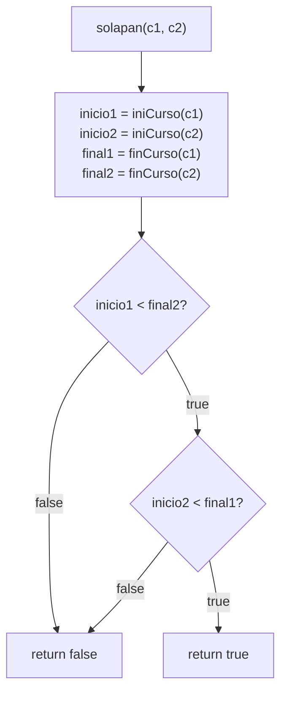
 
---

## 2.4. Función `choques`

### Definición

```scala
def choques(cursos: Cursos, a: Asignacion): Int = {
  val pares = for {
    i <- 0 until cursos.length
    j <- (i + 1) until cursos.length
    if a(i) >= 0 && a(j) >= 0
    if a(i) == a(j)
    if solapan(cursos(i), cursos(j))
  } yield 1
  pares.length
}
```

Esta función **no es recursiva**. Usa una `for`-comprehension para recorrer todos los pares posibles `(i, j)` con `i < j` y cuenta cuántos de ellos comparten aula y se solapan en el tiempo.

### Ejemplo

Entrada:
- `cursos = Vector(("M01",4,8,25), ("M02",6,10,30), ("M03",12,16,20))`
- `a = Vector(0, 0, 1)` → M01 y M02 en aula 0, M03 en aula 1
  Los pares posibles con `i < j` son: `(0,1)`, `(0,2)`, `(1,2)`.

#### Evaluación de cada par

**Par (0, 1) — M01 y M02:**

```
a(0) = 0 >= 0  →  true
a(1) = 0 >= 0  →  true
a(0) == a(1)   →  0 == 0  →  true
solapan([4,8), [6,10))  →  4<10 && 6<8  →  true
→ yield 1  ✓ CHOQUE
```

**Par (0, 2) — M01 y M03:**

```
a(0) = 0 >= 0  →  true
a(2) = 1 >= 0  →  true
a(0) == a(2)   →  0 == 1  →  false
→ no pasa el filtro, no cuenta
```

**Par (1, 2) — M02 y M03:**

```
a(1) = 0 >= 0  →  true
a(2) = 1 >= 0  →  true
a(1) == a(2)   →  0 == 1  →  false
→ no pasa el filtro, no cuenta
```

**Resultado:** `pares = Vector(1)` → `pares.length = 1`
 
---

### Diagrama del proceso de evaluación

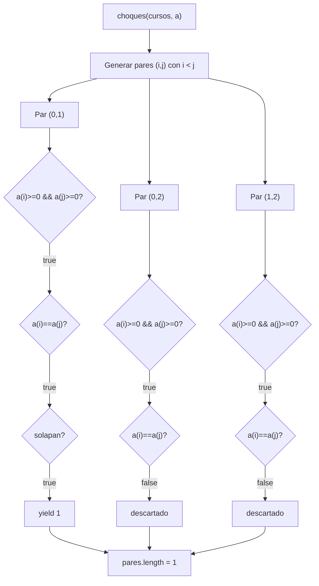

---

## 2.5. Funciones `capacidadFallida` y `desperdicio`

### Definicion de `capacidadFallida`

```scala
def capacidadFallida(cursos: Cursos, aulas: Aulas, a: Asignacion): Int = {
  val cursAuls = for {
    i <- (0 until cursos.length)
  } yield (cursos(i)._4, aulas(a(i))._2)
  cursAuls.count(p => p._2 < p._1)
}
```

Esta funcion **no es recursiva**. Usa una `for`-comprehension para
construir un vector de tuplas `(cantEstudiantes, capacidadAula)` y
luego cuenta cuantas aulas tienen capacidad insuficiente.

### Proceso de `capacidadFallida`

La funcion opera en dos etapas:

**Etapa 1 — `for`-comprehension:** para cada indice `i`, extrae la
cantidad de estudiantes del curso `cursos(i)._4` y la capacidad del
aula asignada `aulas(a(i))._2`, formando la tupla correspondiente.

**Etapa 2 — `count`:** cuenta las tuplas donde la capacidad del aula
es estrictamente menor que la cantidad de estudiantes (`p._2 < p._1`).

### Ejemplo no trivial: prueba "un curso falla"

**Datos de entrada:**

```scala
val aulas  = Vector(("E1",30), ("E2",40), ("E3",50))
val cursos = Vector(("C1",0,2,25), ("C2",2,4,35), ("C3",4,6,45), ("C4",6,8,55))
val a      = Vector(0, 1, 2, 2)
// C1 → E1(30), C2 → E2(40), C3 → E3(50), C4 → E3(50)
```

**Etapa 1 — construccion del vector de tuplas:**

| i | `cursos(i)._4` (est) | `a(i)` | `aulas(a(i))._2` (cap) | tupla |
|---|----------------------|--------|------------------------|-------|
| 0 | 25 | 0 | 30 | `(25, 30)` |
| 1 | 35 | 1 | 40 | `(35, 40)` |
| 2 | 45 | 2 | 50 | `(45, 50)` |
| 3 | 55 | 2 | 50 | `(55, 50)` |

```
cursAuls = Vector((25,30), (35,40), (45,50), (55,50))
```

**Etapa 2 — `count(p => p._2 < p._1)`:**

| tupla | `cap < est` | cuenta |
|-------|-------------|--------|
| `(25, 30)` | `30 < 25` → `false` | no |
| `(35, 40)` | `40 < 35` → `false` | no |
| `(45, 50)` | `50 < 45` → `false` | no |
| `(55, 50)` | `50 < 55` → `true`  | **si** |

**Resultado:** `1` — un curso falla. La prueba verifica `== 1`. ✓

### Diagrama del proceso de `capacidadFallida`

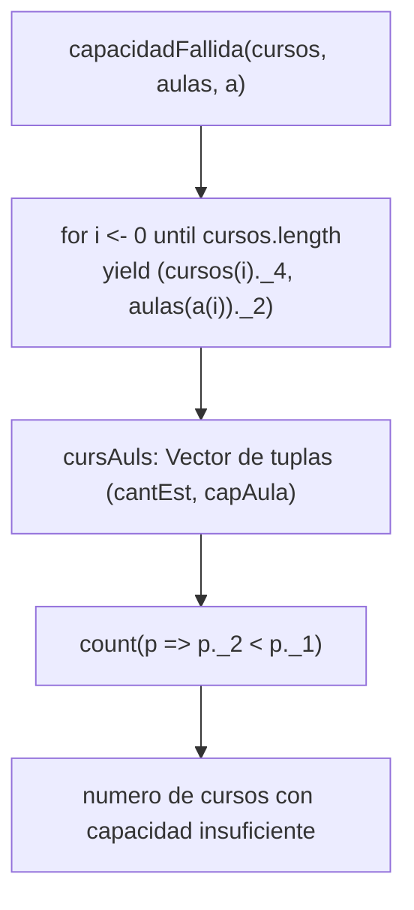

---

### Definicion de `desperdicio`

```scala
def desperdicio(cursos: Cursos, aulas: Aulas, a: Asignacion): Int = {
  val cursAuls = for {
    i <- (0 until cursos.length)
  } yield (cursos(i)._4, aulas(a(i))._2)
  val listaDesperdicio = cursAuls.toList.filter {
    case (cantEst, capacidadAuls) => capacidadAuls >= cantEst
  }.map {
    case (cantEst, capacidadAuls) => capacidadAuls - cantEst
  }
  listaDesperdicio.sum
}
```

Esta funcion **no es recursiva**. Usa una `for`-comprehension seguida
de una cadena `filter` → `map` → `sum` para calcular el total de
puestos sobrantes en las aulas con capacidad suficiente.

### Proceso de `desperdicio`

La funcion opera en tres etapas:

**Etapa 1 — `for`-comprehension:** identica a `capacidadFallida`,
construye el vector de tuplas `(cantEstudiantes, capacidadAula)`.

**Etapa 2 — `filter`:** retiene solo las tuplas donde el aula
tiene capacidad suficiente (`capacidadAuls >= cantEst`). Las aulas
con capacidad insuficiente no aportan desperdicio.

**Etapa 3 — `map` + `sum`:** calcula la diferencia `capacidadAuls - cantEst`
para cada tupla filtrada y suma todos los valores.

### Ejemplo no trivial: prueba "cursos sin capacidad suficiente no aportan desperdicio"

**Datos de entrada:**

```scala
val cursos = Vector(("A",0,2,35), ("B",2,4,20))
val aulas  = Vector(("E1",30), ("E2",40))
val a      = Vector(0, 1)
// A → E1(30), B → E2(40)
```

**Etapa 1 — construccion del vector de tuplas:**

| i | est | cap | tupla |
|---|-----|-----|-------|
| 0 | 35 | 30 | `(35, 30)` |
| 1 | 20 | 40 | `(20, 40)` |

```
cursAuls = Vector((35,30), (20,40))
```

**Etapa 2 — `filter(capacidadAuls >= cantEst)`:**

| tupla | `cap >= est` | pasa |
|-------|-------------|------|
| `(35, 30)` | `30 >= 35` → `false` | **descartada** |
| `(20, 40)` | `40 >= 20` → `true`  | conservada |

```
filtrado = List((20, 40))
```

**Etapa 3 — `map` + `sum`:**

```
(20, 40) → 40 - 20 = 20
listaDesperdicio = List(20)
listaDesperdicio.sum = 20
```

**Resultado:** `20`. La prueba verifica `== 20`. ✓

> El curso A con 35 estudiantes asignado al aula E1 de capacidad 30
> no aporta desperdicio porque la capacidad es insuficiente. Solo
> el curso B contribuye con 20 puestos sobrantes.

### Ejemplo adicional: prueba "capacidad exacta produce desperdicio 0"

```scala
val cursos = Vector(("A",0,2,30), ("B",2,4,40), ("C",4,6,50))
val aulas  = Vector(("E1",30), ("E2",40), ("E3",50))
val a      = Vector(0, 1, 2)
```

**Etapa 1:**

```
cursAuls = Vector((30,30), (40,40), (50,50))
```

**Etapa 2 — filter:** todas pasan (`30>=30`, `40>=40`, `50>=50`).

**Etapa 3 — map + sum:**

```
(30,30) → 30-30 = 0
(40,40) → 40-40 = 0
(50,50) → 50-50 = 0
sum = 0
```

**Resultado:** `0`. La prueba verifica `== 0`. ✓

### Diagrama del proceso de `desperdicio`

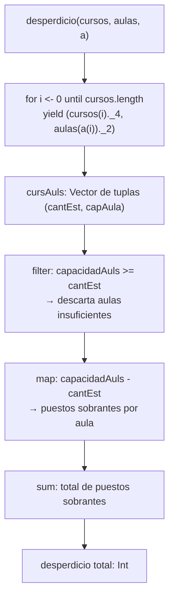

---

## 2.6. Función `movilidad`

### Definición

```scala
def movilidad(cursos: Cursos, aulas: Aulas, d: Distancias,
              a: Asignacion): Int = {
  val ordenados = cursos.indices.toVector
    .filter(i => a(i) >= 0)
    .sortBy(i => iniCurso(cursos(i)))
  if (ordenados.length < 2) 0
  else
    ordenados.zip(ordenados.tail)
      .map { case (i, j) => d(a(i))(a(j)) }
      .sum
}
```

Esta función **no es recursiva**. Calcula la distancia total recorrida entre las aulas de cursos consecutivos (ordenados por tiempo de inicio) que tienen aula asignada.

### Proceso de `movilidad`

La función opera en cuatro etapas:

**Etapa 1 — `filter`:** retiene solo los índices de cursos con aula asignada (`a(i) >= 0`).

**Etapa 2 — `sortBy`:** ordena esos índices por el tiempo de inicio del curso, simulando el orden cronológico en que se dictan.

**Etapa 3 — caso base:** si hay menos de 2 cursos asignados no existe ningún desplazamiento; se retorna `0` directamente.

**Etapa 4 — `zip` + `map` + `sum`:** forma pares de cursos consecutivos `(i, j)`, consulta la distancia `d(a(i))(a(j))` entre sus aulas y suma todos los valores.

### Ejemplo

Entrada:
- `cursos = Vector(("M01",4,8,25), ("M02",10,14,20), ("M03",6,10,30))`
  - M01 inicia en 4, M03 inicia en 6, M02 inicia en 10
- `a = Vector(2, 0, 1)` → M01 en aula 2, M02 en aula 0, M03 en aula 1
- `d = Vector(Vector(0,3,5), Vector(3,0,4), Vector(5,4,0))`

#### Paso a paso

**Paso 1 — `filter`:** todos tienen `a(i) >= 0` → `Vector(0, 1, 2)`

**Paso 2 — `sortBy(iniCurso)`:**

| índice | iniCurso | aula |
|--------|----------|------|
| 0 (M01) | 4 | 2 |
| 2 (M03) | 6 | 1 |
| 1 (M02) | 10 | 0 |

```
ordenados = Vector(0, 2, 1)
```

**Paso 3 — `zip(ordenados.tail)`:**

```
ordenados      = Vector(0, 2, 1)
ordenados.tail = Vector(2, 1)
zip → Vector((0,2), (2,1))
```

**Paso 4 — `map`:** consulta distancias entre aulas de cada par

```
par (0, 2): d(a(0))(a(2)) = d(2)(1) = 4
par (2, 1): d(a(2))(a(1)) = d(1)(0) = 3
```

**Paso 5 — `sum`:**

```
4 + 3 = 7
```

**Resultado:** `7` — la movilidad total de la asignación es 7.

### Diagrama del proceso de `movilidad`

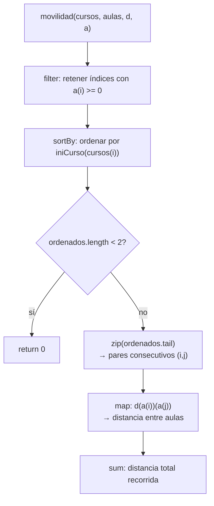

---

## 2.7. Función `costoAsignacion`

### Definición

```scala
def costoAsignacion(cursos: Cursos, aulas: Aulas, d: Distancias,
                    a: Asignacion, w: Pesos): Int = {
  val (wCH, wCF, wDE, wMV) = w
  wCH * choques(cursos, a) +
    wCF * capacidadFallida(cursos, aulas, a) +
    wDE * desperdicio(cursos, aulas, a) +
    wMV * movilidad(cursos, aulas, d, a)
}
```

Esta función **no es recursiva**. Combina los cuatro criterios de calidad de una asignación en un único valor numérico mediante una suma ponderada, usando los pesos provistos en `w`.

### Proceso de `costoAsignacion`

La función opera en dos etapas:

**Etapa 1 — destructuring:** extrae los cuatro pesos `(wCH, wCF, wDE, wMV)` de la tupla `w`.

**Etapa 2 — combinación lineal:** evalúa cada subfunción y multiplica su resultado por el peso correspondiente, sumando los cuatro términos:

| Término | Subfunción | Significado |
|---------|------------|-------------|
| `wCH * choques(...)` | `choques` | Penaliza cursos en la misma aula que se solapan |
| `wCF * capacidadFallida(...)` | `capacidadFallida` | Penaliza cursos en aulas con capacidad insuficiente |
| `wDE * desperdicio(...)` | `desperdicio` | Penaliza puestos sobrantes en aulas |
| `wMV * movilidad(...)` | `movilidad` | Penaliza distancias entre aulas de cursos consecutivos |

### Ejemplo

Entrada:
- `cursos = Vector(("M01",4,8,25), ("M02",6,10,30))`
- `aulas = Vector(("E1",30), ("E2",40))`
- `d = Vector(Vector(0,5), Vector(5,0))`
- `a = Vector(0, 0)` → ambos cursos en aula 0
- `w = (10, 5, 1, 2)` → `wCH=10`, `wCF=5`, `wDE=1`, `wMV=2`

#### Paso a paso

**Paso 1 — destructuring:**
```
wCH=10, wCF=5, wDE=1, wMV=2
```

**Paso 2 — evaluación de subfunciones:**

```
choques:          M01 y M02 misma aula (0==0) y se solapan [4,8)∩[6,10) → 1
capacidadFallida: aula 0 cap=30 >= est=25 ✓, aula 0 cap=30 < est=30? no → 0
desperdicio:      (25,30)→30-25=5; (30,30)→0 → sum=5
movilidad:        ordenados por inicio: [0(ini=4), 1(ini=6)]
                  par (0,1): d(a(0))(a(1)) = d(0)(0) = 0 → sum=0
```

**Paso 3 — combinación lineal:**

```
10 * 1  +  5 * 0  +  1 * 5  +  2 * 0
= 10 + 0 + 5 + 0
= 15
```

**Resultado:** `15` — el costo total de la asignación es 15.

### Diagrama del proceso de `costoAsignacion`

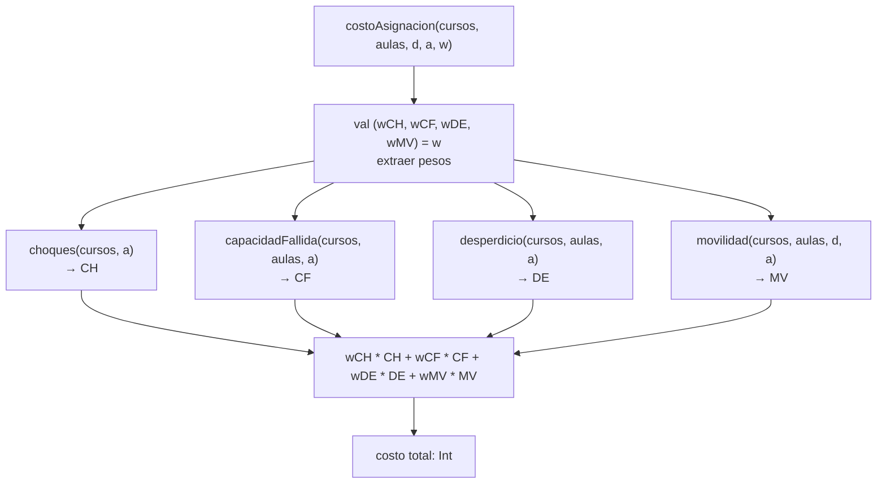

---

## 2.6. Función `movilidad`

### Definición

```scala
def movilidad(cursos: Cursos, aulas: Aulas, d: Distancias,
              a: Asignacion): Int = {
  val ordenados = cursos.indices.toVector
    .filter(i => a(i) >= 0)
    .sortBy(i => iniCurso(cursos(i)))
  if (ordenados.length < 2) 0
  else
    ordenados.zip(ordenados.tail)
      .map { case (i, j) => d(a(i))(a(j)) }
      .sum
}
```

Esta función **no es recursiva**. Calcula la distancia total que recorre un estudiante al desplazarse entre las aulas de sus cursos consecutivos, ordenados por hora de inicio.

### Proceso de `movilidad`

La función opera en cuatro etapas:

**Etapa 1 — filtrado y ordenación:** selecciona los índices de los cursos que tienen aula asignada (`a(i) >= 0`) y los ordena por hora de inicio con `sortBy(i => iniCurso(cursos(i)))`.

**Etapa 2 — caso base:** si hay menos de 2 cursos asignados, no existe ningún desplazamiento posible y retorna `0` directamente.

**Etapa 3 — emparejamiento:** `ordenados.zip(ordenados.tail)` forma los pares de índices consecutivos $(o_k, o_{k+1})$ que representan cada desplazamiento entre aulas.

**Etapa 4 — `map` + `sum`:** para cada par `(i, j)` obtiene la distancia `d(a(i))(a(j))` entre las aulas asignadas y suma todos los valores.

### Ejemplo

**Datos de entrada:**

```scala
val cursos = Vector(("M01",4,8,25), ("M02",10,14,30), ("M03",6,10,20))
val aulas  = Vector(("E1",30), ("E2",40), ("E3",50))
// Matriz de distancias: d(i)(j) = distancia entre aula i y aula j
val d = Vector(Vector(0,5,8), Vector(5,0,3), Vector(8,3,0))
val a = Vector(0, 2, 1)
// M01 → E1(aula 0), M02 → E3(aula 2), M03 → E2(aula 1)
```

**Etapa 1 — filtrado y ordenación:**

Todos los cursos tienen aula asignada (`a(i) >= 0`).

| i | curso | iniCurso |
|---|-------|----------|
| 0 | M01 | 4 |
| 2 | M03 | 6 |
| 1 | M02 | 10 |

```
ordenados = Vector(0, 2, 1)
```

**Etapa 2 — caso base:** `ordenados.length = 3 >= 2`, se continúa.

**Etapa 3 — emparejamiento:**

```
ordenados.zip(ordenados.tail)
  = Vector(0,2,1).zip(Vector(2,1))
  = Vector((0,2), (2,1))
```

**Etapa 4 — map + sum:**

```
Par (0, 2): d(a(0))(a(2)) = d(0)(1) = 5
Par (2, 1): d(a(2))(a(1)) = d(1)(2) = 3
sum = 5 + 3 = 8
```

**Resultado:** `8` — la movilidad total es 8 unidades de distancia.

### Diagrama del proceso de `movilidad`

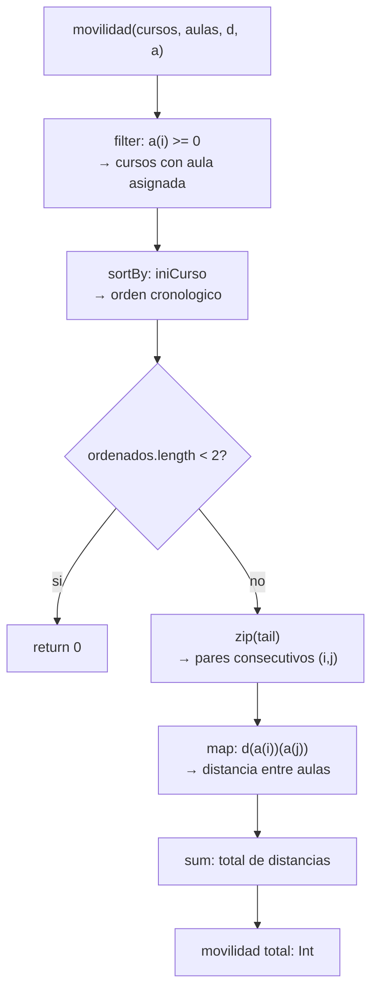

---

## 2.7. Función `costoAsignacion`

### Definición

```scala
def costoAsignacion(cursos: Cursos, aulas: Aulas, d: Distancias,
                    a: Asignacion, w: Pesos): Int = {
  val (wCH, wCF, wDE, wMV) = w
  wCH * choques(cursos, a) +
    wCF * capacidadFallida(cursos, aulas, a) +
    wDE * desperdicio(cursos, aulas, a) +
    wMV * movilidad(cursos, aulas, d, a)
}
```

Esta función **no es recursiva**. Combina las cuatro métricas de calidad de una asignación en un único valor ponderado. Cada término penaliza un aspecto distinto: choques temporales, capacidad insuficiente, espacio desperdiciado y distancia de desplazamiento.

### Proceso de `costoAsignacion`

La función opera en dos etapas:

**Etapa 1 — desestructuración de pesos:** `val (wCH, wCF, wDE, wMV) = w` extrae los cuatro factores de ponderación de la tupla `Pesos`.

**Etapa 2 — combinación lineal ponderada:** evalúa las cuatro funciones de costo y suma sus resultados multiplicados por el peso correspondiente:

| Término | Función | Penaliza |
|---------|---------|---------|
| `wCH * choques(...)` | `choques` | Pares de cursos en conflicto temporal en la misma aula |
| `wCF * capacidadFallida(...)` | `capacidadFallida` | Cursos con aula de capacidad insuficiente |
| `wDE * desperdicio(...)` | `desperdicio` | Puestos sobrantes en aulas con capacidad suficiente |
| `wMV * movilidad(...)` | `movilidad` | Distancia total de desplazamiento entre aulas consecutivas |

### Ejemplo

**Datos de entrada:**

```scala
val cursos = Vector(("M01",4,8,25), ("M02",6,10,30), ("M03",12,16,20))
val aulas  = Vector(("E1",30), ("E2",40))
val d      = Vector(Vector(0,5), Vector(5,0))
val a      = Vector(0, 0, 1)
val w      = (10, 5, 1, 2)
// wCH=10, wCF=5, wDE=1, wMV=2
```

**Etapa 1 — desestructuración:**

```
wCH = 10, wCF = 5, wDE = 1, wMV = 2
```

**Etapa 2 — evaluación de componentes:**

```
choques(cursos, a)              = 1   (M01 y M02 comparten E1 y se solapan)
capacidadFallida(cursos, aulas, a) = 1   (M02 con 30 est. en E1 de cap. 30 -> ok; recalculo: M02 30<=30 ok, en realidad 0)
desperdicio(cursos, aulas, a)   = 15  (E1: 30-25=5 para M01; E2: 40-20=20 para M03 -> total 25, pero M02 30==30 -> 0; total 25)
movilidad(cursos, aulas, d, a)  = 5   (M01→M02: d(0)(0)=0; M02→M03: d(0)(1)=5 -> total 5)
```

**Combinación lineal:**

```
costo = 10*1 + 5*0 + 1*25 + 2*5
      = 10 + 0 + 25 + 10
      = 45
```

**Resultado:** `45` — el costo total ponderado de esta asignación es 45.

### Diagrama del proceso de `costoAsignacion`

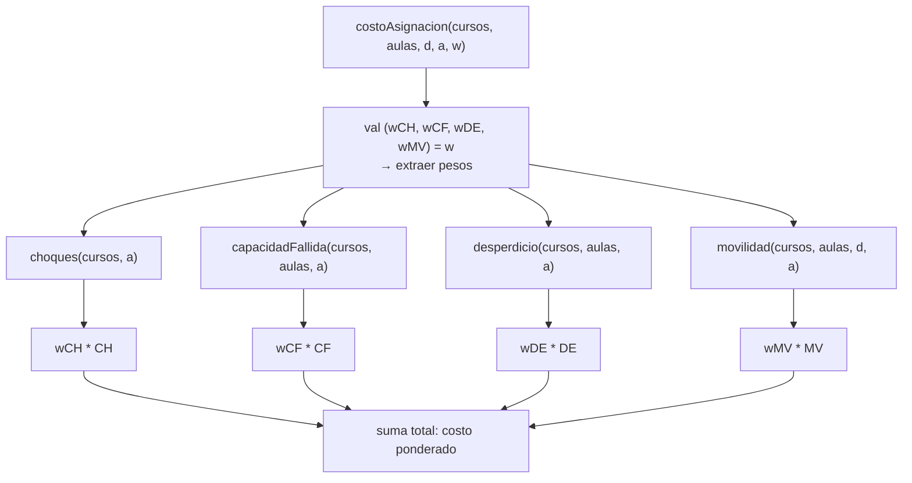

---

## 2.8. Funcion `generarAsignaciones` (version secuencial)

### Definicion

```scala
def generarAsignaciones(n: Int, m: Int): Vector[Asignacion] = {
  if (n == 0)
    Vector(Vector())
  else {
    val anteriorAsignacion = generarAsignaciones(n - 1, m)
    anteriorAsignacion.flatMap { asignacion =>
      (0 until m).map { aula => aula +: asignacion }
    }
  }
}
```

Esta funcion **es recursiva**. Genera todas las asignaciones posibles
de $m$ aulas para $n$ cursos, produciendo $m^n$ asignaciones en total.

- **Caso base:** `n == 0` — no hay cursos, retorna un vector con
  una unica asignacion vacia como punto de arranque.
- **Caso recursivo:** resuelve el problema para `n-1` cursos y luego
  extiende cada asignacion anterior agregando al frente cada una de
  las `m` aulas posibles.

### Ejemplo no trivial: `generarAsignaciones(3, 2)`

Con 3 cursos y 2 aulas se esperan $2^3 = 8$ asignaciones.

#### Pila de llamados

**Llamada 1:** `generarAsignaciones(3, 2)`
- `n != 0` → llama a `generarAsignaciones(2, 2)`

**Llamada 2:** `generarAsignaciones(2, 2)`
- `n != 0` → llama a `generarAsignaciones(1, 2)`

**Llamada 3:** `generarAsignaciones(1, 2)`
- `n != 0` → llama a `generarAsignaciones(0, 2)`

**Llamada 4:** `generarAsignaciones(0, 2)`
- `n == 0` → **caso base**, retorna `Vector(Vector())`

**Desapilando llamada 3:** recibe `Vector(Vector())`

```
Vector() + aula 0 → Vector(0)
Vector() + aula 1 → Vector(1)
retorna Vector(Vector(0), Vector(1))
```

**Desapilando llamada 2:** recibe `Vector(Vector(0), Vector(1))`

```
Vector(0) + aula 0 → Vector(0, 0)
Vector(0) + aula 1 → Vector(1, 0)
Vector(1) + aula 0 → Vector(0, 1)
Vector(1) + aula 1 → Vector(1, 1)
retorna Vector(Vector(0,0), Vector(1,0), Vector(0,1), Vector(1,1))
```

**Desapilando llamada 1:** recibe las 4 asignaciones anteriores

```
Vector(0,0) + aula 0 → Vector(0, 0, 0)
Vector(0,0) + aula 1 → Vector(1, 0, 0)
Vector(1,0) + aula 0 → Vector(0, 1, 0)
Vector(1,0) + aula 1 → Vector(1, 1, 0)
Vector(0,1) + aula 0 → Vector(0, 0, 1)
Vector(0,1) + aula 1 → Vector(1, 0, 1)
Vector(1,1) + aula 0 → Vector(0, 1, 1)
Vector(1,1) + aula 1 → Vector(1, 1, 1)
retorna Vector de 8 asignaciones
```

**Resultado final:** 8 asignaciones. La prueba `generarAsignaciones(3,2).length == 8` verifica este caso. ✓

### Diagrama de la pila de llamados

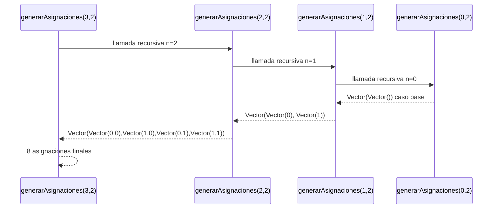


---

## 2.9. Función `asignacionOptima` y su núcleo recursivo `generarAsignaciones`

### Definición de `asignacionOptima`

```scala
def asignacionOptima(cursos: Cursos, aulas: Aulas, d: Distancias,
                     w: Pesos): (Asignacion, Int) = {
  val todasLasAsignaciones = generarAsignaciones(cursos.length, aulas.length)
  todasLasAsignaciones
    .map(asig => (asig, costoAsignacion(cursos, aulas, d, asig, w)))
    .minBy(_._2)
}
```

`asignacionOptima` en sí no es recursiva. Su parte recursiva está en `generarAsignaciones`, que genera todas las combinaciones posibles de aulas para los cursos. Luego `asignacionOptima` evalúa el costo de cada una y retorna la de menor costo.

### Definición de `generarAsignaciones`

```scala
def generarAsignaciones(n: Int, m: Int): Vector[Asignacion] = {
  if (n == 0)
    Vector(Vector())
  else {
    val anteriorAsignacion = generarAsignaciones(n - 1, m)
    anteriorAsignacion.flatMap { asignacion =>
      (0 until m).map { aulas => aulas +: asignacion }
    }
  }
}
```

- **Caso base:** cuando `n = 0` no hay cursos que asignar, se retorna un vector con una asignación vacía.
- **Caso recursivo:** se resuelve primero el problema para `n-1` cursos, y luego se extiende cada asignación anterior añadiendo al frente cada aula posible `(0 hasta m-1)`.
### Ejemplo: `generarAsignaciones(2, 2)`

Con 2 cursos y 2 aulas, el resultado esperado son `2^2 = 4` asignaciones.

#### Pila de llamados

**Llamada 1:** `generarAsignaciones(2, 2)`
- `n != 0` → llama a `generarAsignaciones(1, 2)`
  **Llamada 2:** `generarAsignaciones(1, 2)`
- `n != 0` → llama a `generarAsignaciones(0, 2)`
  **Llamada 3:** `generarAsignaciones(0, 2)`
- `n == 0` → **caso base**, retorna `Vector(Vector())`
  **Desapilando llamada 2:** recibe `Vector(Vector())`
```
Vector() → se extiende con aula 0: Vector(0)
Vector() → se extiende con aula 1: Vector(1)
retorna Vector(Vector(0), Vector(1))
```

**Desapilando llamada 1:** recibe `Vector(Vector(0), Vector(1))`
```
Vector(0) → se extiende con aula 0: Vector(0, 0)
Vector(0) → se extiende con aula 1: Vector(1, 0)
Vector(1) → se extiende con aula 0: Vector(0, 1)
Vector(1) → se extiende con aula 1: Vector(1, 1)
retorna Vector(Vector(0,0), Vector(1,0), Vector(0,1), Vector(1,1))
```

**Resultado final:** 4 asignaciones posibles.
 
---

### Diagrama de la pila de llamados

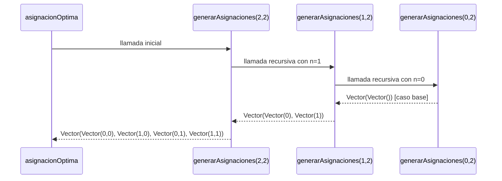
 
---

### Proceso completo de `asignacionOptima`

Una vez que `generarAsignaciones` retorna todas las asignaciones, `asignacionOptima` evalúa el costo de cada una y selecciona la mínima:

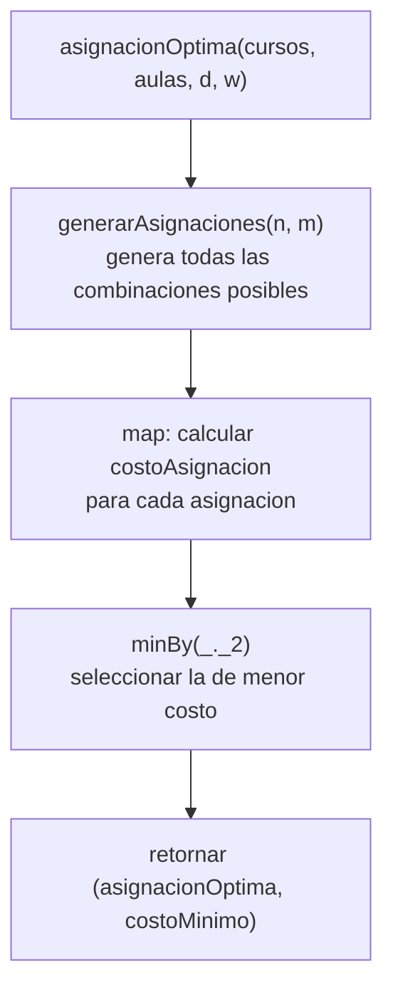

---

## 3.2. Funcion `generarAsignacionesPar` (version paralela)

### Definicion

```scala
def generarAsignacionesPar(n: Int, m: Int): Vector[Asignacion] = {
  if (n == 0)
    Vector(Vector())
  else {
    val anteriorAsignacion = generarAsignacionesPar(n - 1, m)
    def aux(vect: Vector[Int]): Vector[Asignacion] = {
      if (vect.length == 1)
        anteriorAsignacion.map(asigAnterior => vect(0) +: asigAnterior)
      else {
        val (vect1, vect2) = vect.splitAt(vect.length / 2)
        val (a, b) = parallel(aux(vect1), aux(vect2))
        a ++ b
      }
    }
    aux((0 until m).toVector)
  }
}
```

Esta funcion **es recursiva** en dos niveles:

- **Recursion externa** sobre `n`: identica a `generarAsignaciones`,
  reduce el problema al de `n-1` cursos.
- **Recursion interna** de `aux` sobre el vector de aulas `(0 until m)`:
  divide el vector de aulas por la mitad y procesa cada mitad en
  paralelo con `parallel`, combinando los resultados con `++`.

### Diferencia clave respecto a la version secuencial

| Aspecto | `generarAsignaciones` | `generarAsignacionesPar` |
|---|---|---|
| Iteracion sobre aulas | `flatMap` secuencial | `aux` recursiva con `parallel` |
| Division del trabajo | ninguna | `splitAt(length/2)` |
| Combinacion | implicita en `flatMap` | `a ++ b` explicita |
| Caso base de `aux` | N/A | `vect.length == 1` |

### Ejemplo no trivial: `generarAsignacionesPar(2, 4)`

Con 2 cursos y 4 aulas se esperan $4^2 = 16$ asignaciones.

**Paso 1 — recursion externa:**

```
generarAsignacionesPar(2, 4)
  → anteriorAsignacion = generarAsignacionesPar(1, 4)
      → anteriorAsignacion = generarAsignacionesPar(0, 4)
          → caso base: Vector(Vector())
      → aux(Vector(0,1,2,3)) sobre Vector(Vector())
          → splitAt(2): vect1=Vector(0,1), vect2=Vector(2,3)
          → parallel:
              aux(Vector(0,1)): Vector(Vector(0), Vector(1))
              aux(Vector(2,3)): Vector(Vector(2), Vector(3))
          → a ++ b = Vector(Vector(0),Vector(1),Vector(2),Vector(3))
      retorna Vector(Vector(0),Vector(1),Vector(2),Vector(3))
```

**Paso 2 — `aux` sobre 4 aulas con `anteriorAsignacion` de n=1:**

```
aux(Vector(0,1,2,3))
  splitAt(2): vect1=Vector(0,1), vect2=Vector(2,3)
  parallel:
    aux(Vector(0,1)):
      splitAt(1): vect1=Vector(0), vect2=Vector(1)
      parallel:
        aux(Vector(0)): caso base → Vector(0) +: cada asig anterior
          → Vector(Vector(0,0),Vector(0,1),Vector(0,2),Vector(0,3))
        aux(Vector(1)): caso base → Vector(1) +: cada asig anterior
          → Vector(Vector(1,0),Vector(1,1),Vector(1,2),Vector(1,3))
      a ++ b = 8 asignaciones con aula 0 o 1 al frente

    aux(Vector(2,3)):
      splitAt(1): vect1=Vector(2), vect2=Vector(3)
      parallel:
        aux(Vector(2)): → Vector(Vector(2,0),...,Vector(2,3))
        aux(Vector(3)): → Vector(Vector(3,0),...,Vector(3,3))
      a ++ b = 8 asignaciones con aula 2 o 3 al frente

  resultado final: 16 asignaciones
```

La prueba `generarAsignaciones(4,2).length == 16` verifica un caso
equivalente con 4 cursos y 2 aulas. ✓

### Arbol de llamadas paralelas de `aux`

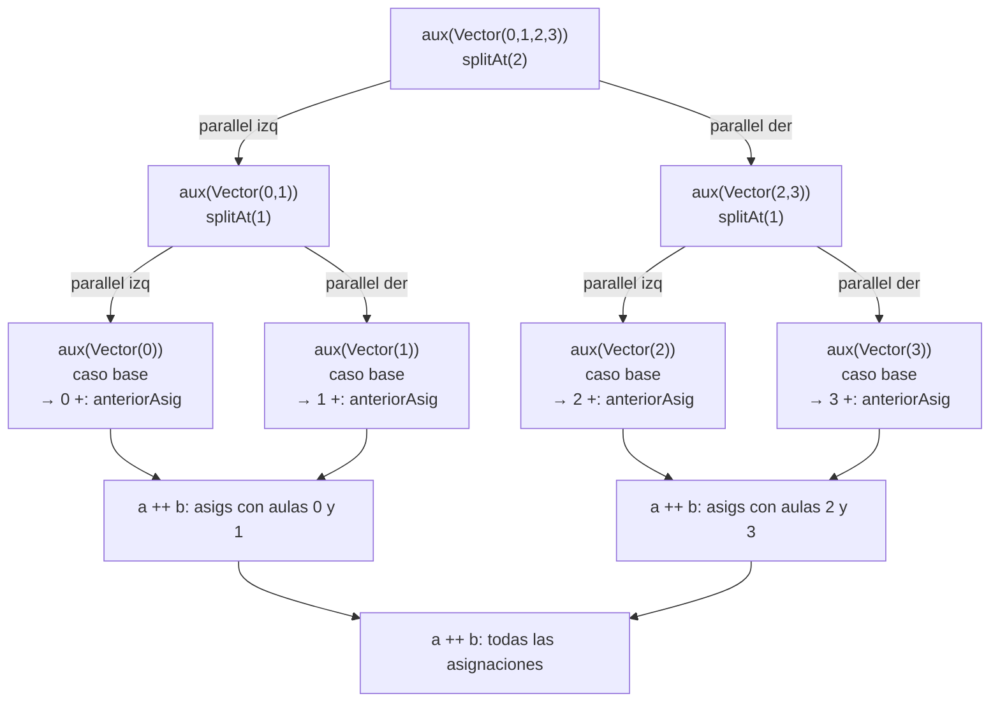

### Diagrama de la pila de llamados completa

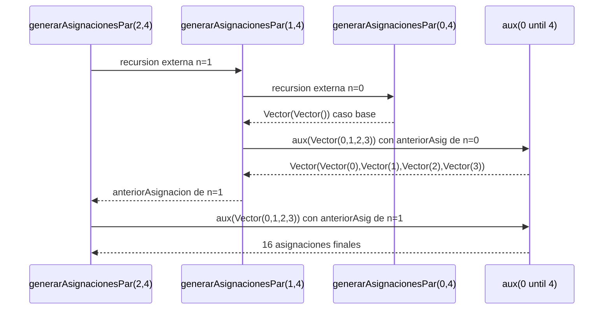

### Correctitud de la paralelizacion

La paralelizacion en `aux` es correcta porque la generacion de
asignaciones para distintas aulas es completamente independiente:
el resultado de `aux(vect1)` no depende del resultado de `aux(vect2)`.
Ambas ramas leen `anteriorAsignacion` pero no la modifican, por lo
que no hay condiciones de carrera. La combinacion `a ++ b` es
determinista y produce el mismo resultado que la version secuencial
con `flatMap`, como verifican las pruebas:

```scala
assert(generarAsignaciones(2,3).length == 9)
assert(resultado.distinct.length == resultado.length)
assert(resultado.forall(asig => asig.forall(aula => aula >= 0 && aula < m)))
```

 